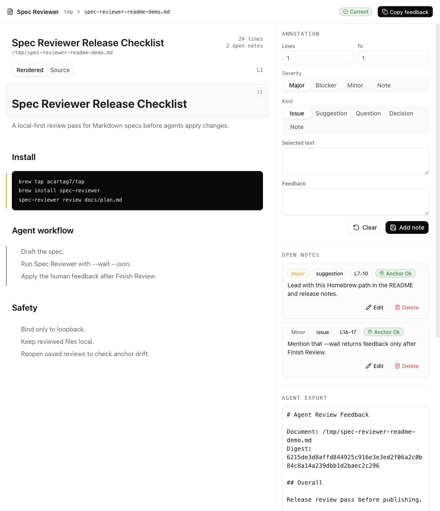

# Spec Reviewer

Local-first Markdown spec reviewer for source-anchored feedback.



Spec Reviewer runs on your machine, opens local Markdown files, lets you annotate
rendered or source text by line, tracks whether saved anchors drift after the
file changes, and exports clean Markdown feedback for an agent or teammate.

## Features

- Open any local `.md` or `.markdown` file.
- Drop a Markdown file into the start screen, or paste a local file path.
- Read rendered Markdown by default with a source toggle for line inspection.
- Add line, block, or text-selection anchored annotations.
- See inline note markers and per-note anchor drift state.
- Preview fenced HTML/SVG artifacts only after an explicit sandboxed render.
- Reopen previous reviews from the recent reviews list.
- Export Markdown instructions grouped by severity.
- Run as a loopback-only bundled binary for users, with a Node/Vite dev setup
  for contributors.

## User Install

The public install path is Homebrew:

```bash
brew tap acartag7/tap
brew install spec-reviewer
spec-reviewer review path/to/spec.md
```

The release artifact is a Bun-compiled binary, so normal users should not need
to manage Node, pnpm, or project dependencies.

## Development Requirements

- Node.js 24 or newer.
- pnpm 10.32.0 or newer.
- Bun 1.3.6 or newer for binary builds.

## Supply Chain Policy

- Use `pnpm` only.
- Keep dependencies pinned exactly and add new ones only for a real blocker.
- `pnpm-workspace.yaml` sets `minimumReleaseAge: 21600` for future installs,
  which means dependency versions must be at least 15 days old.
- Do not add postinstall-dependent packages without a specific reason.
- See [docs/dependencies.md](docs/dependencies.md).

## Install For Development

```bash
pnpm install
pnpm run build
```

## Run In Development

```bash
pnpm run dev
```

Open the dev app:

```text
http://127.0.0.1:5173
```

## Run The Built App

```bash
pnpm start -- review path/to/spec.md
pnpm start -- review --port 3220 path/to/spec.md
pnpm start -- review --storage-dir ~/.spec-reviewer path/to/spec.md
```

The production server serves the built app and API from `127.0.0.1:3217` by
default.

## Build The Binary

```bash
pnpm run build:binary
./build/spec-reviewer review path/to/spec.md
./build/spec-reviewer review path/to/spec.md --wait --json
```

## Data Storage

- Saved reviews live under `~/.spec-reviewer/reviews`.
- Dropped files are copied under `~/.spec-reviewer/documents`.
- Reviewed source files are not modified.
- No telemetry is sent.

Browsers do not expose the original absolute path for drag/drop files, so dropped
files are copied into the storage directory and reviewed from there.

## Anchor State

Every saved review stores the document digest it was created against. When a file
is reopened, the UI shows whether the saved notes are:

- `current`: notes match the current file digest;
- `changed`: the file changed and line anchors should be rechecked;
- `missing`: a recent review points at a path that no longer exists;
- `unreviewed`: no saved notes exist yet.

Each annotation also stores a source-text snapshot. If the file changes, Spec
Reviewer marks notes as `ok`, `moved`, or `not-found` and warns in the export
instead of silently relocating edits.

## Security Model

The API can read local Markdown files by path, so the server binds only to
loopback hosts. It rejects non-loopback Host/Origin headers and sends a CSP.
Rendered Markdown is sanitized before insertion. Artifact previews render in
click-to-render sandboxed iframes with `sandbox=""`.

See [docs/security-model.md](docs/security-model.md).

## Verify

```bash
pnpm run check
pnpm run build:binary
pnpm run binary:smoke
```

The code follows a DDD-lite layout:

- `src/domain`: document and review shapes.
- `src/application`: use cases and export formatting.
- `src/infrastructure`: filesystem adapters.
- `src/interfaces`: local HTTP and static UI.

Files stay at or below 250 lines so review and agent edits stay manageable.

## Contributing

See [CONTRIBUTING.md](CONTRIBUTING.md).

## License

MIT. See [LICENSE](LICENSE).
