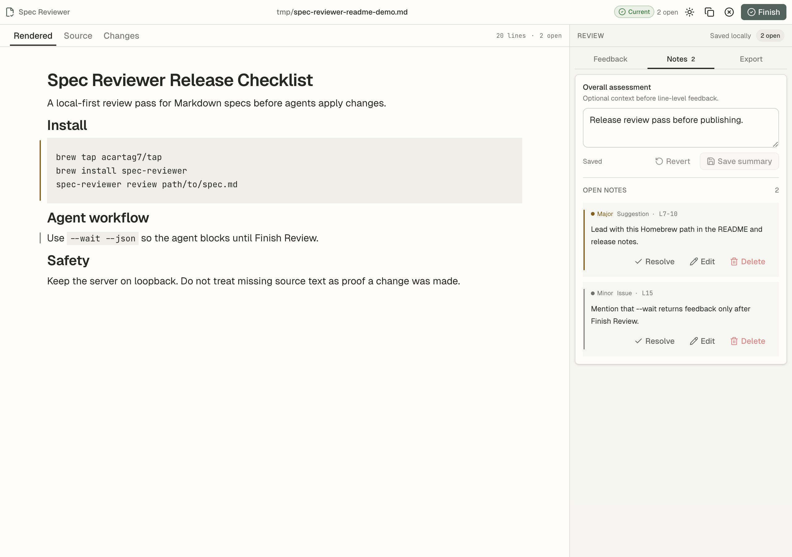

# Spec Reviewer

Local-first Markdown spec reviewer for source-anchored agent feedback.

## Install With Homebrew

```bash
brew tap acartag7/tap
brew install spec-reviewer
spec-reviewer review path/to/spec.md
```

Homebrew installs a bundled binary. You do not need Node, pnpm, Bun, or project
dependencies to use the app.



## Agent Handoff

```bash
spec-reviewer review path/to/spec.md --wait --json
```

`--wait` keeps the command open until the human clicks Finish Review or Cancel.
On finish, the command prints Markdown feedback for the agent to apply.

In the app, **Handoff & copy** saves an immutable checkpoint for a local source
file before it writes feedback to the clipboard. After the agent edits the file,
reopening the review shows changes against that exact handoff. Dropped uploads
remain immutable and do not create a comparison baseline.

## What It Does

- Opens local `.md` and `.markdown` files.
- Lets you review rendered Markdown or source lines.
- Keeps Markdown tables readable and renders Mermaid diagrams as sanitized static SVG.
- Shows completed-round changes as a bounded unified red/green diff.
- Adds line, block, or selected-text notes.
- Saves an immutable checkpoint for a local source file before feedback is copied to an agent.
- Tracks per-note anchors as `ok`, `moved`, `ambiguous`, or `not-found` after edits.
- Reopens previous reviews from local state.
- Exports agent-ready Markdown feedback grouped by severity.
- Runs loopback-only from a bundled binary.

## Agent Skill Install

```bash
spec-reviewer skill install --target codex
spec-reviewer skill install --target claude
spec-reviewer skill print --target codex
```

Skill install backs up existing files before overwriting. User scope writes to
the agent's home skills directory; project scope writes under the current repo.
The bundled skill teaches the Finish/Cancel workflow, durable handoff baselines,
and manual confirmation for moved or missing anchors.

## Development Requirements

- Node.js 24 or newer.
- pnpm 10.32.0 or newer.
- Bun 1.3.6 or newer for binary builds.

## Supply Chain Policy

- Use `pnpm` only.
- Keep dependencies pinned exactly and add new ones only for a real blocker.
- `pnpm-workspace.yaml` sets `minimumReleaseAge: 21600` for future installs,
  which means dependency versions must be at least 15 days old.
- Do not add postinstall-dependent packages without a specific reason.
- See [docs/dependencies.md](docs/dependencies.md).

## Install For Development

```bash
pnpm install
pnpm run build
```

## Run In Development

```bash
pnpm run dev
```

Open the dev app:

```text
http://127.0.0.1:5173
```

## Run The Built App

```bash
pnpm start -- review path/to/spec.md
pnpm start -- review --port 3220 path/to/spec.md
pnpm start -- review --storage-dir ~/.spec-reviewer path/to/spec.md
```

The production server serves the built app and API from `127.0.0.1:3217` by
default. A round write tightens an existing real storage directory to `0700`;
symlinked storage components are rejected. The storage filesystem must support
same-directory hard links and have enough free space for immutable round files.

## Build The Binary

```bash
pnpm run build:binary
./build/spec-reviewer review path/to/spec.md
./build/spec-reviewer review path/to/spec.md --wait --json
```

## Data Storage

- Saved reviews live under `~/.spec-reviewer/reviews`.
- Dropped files are copied under `~/.spec-reviewer/documents`.
- Immutable Handoff & copy and completed waiting-session checkpoints live under
  `~/.spec-reviewer/rounds`.
- Reviewed source files are not modified.
- No telemetry is sent.

Browsers do not expose the original absolute path for drag/drop files, so dropped
files are copied into the storage directory and reviewed from there.

## Anchor State

Every saved review stores the document digest it was created against. When a file
is reopened, the UI shows whether the saved notes are:

- `current`: notes match the current file digest;
- `changed`: the file changed and line anchors should be rechecked;
- `missing`: a recent review points at a path that no longer exists;
- `unreviewed`: no saved notes exist yet.

Each annotation also stores a source-text snapshot. If the file changes, Spec
Reviewer marks notes as `ok`, `moved`, `ambiguous`, or `not-found` and warns in the export
instead of silently relocating edits.

An unresolved note remains visible and stays in the agent export until the human
resolves or deletes it. Missing source text is not treated as proof that the
requested change was made. Relocated (`moved`), duplicate (`ambiguous`), and
missing (`not-found`) notes are flagged for manual checking.
Open and resolved notes are listed separately, with direct Resolve and Reopen
actions. Editing a note preserves its lifecycle status and agent action.

## Security Model

The API can read local Markdown files by path, so the server binds only to
loopback hosts. It rejects non-loopback Host/Origin headers and sends a CSP.
Rendered Markdown is sanitized before insertion. Artifact previews render in
click-to-render sandboxed iframes with `sandbox=""`.

See [docs/security-model.md](docs/security-model.md).

## Verify

```bash
pnpm run check
pnpm run build:binary
pnpm run binary:smoke
```

`pnpm run check` type-checks both the web application and the server test suite.

## Release

```bash
pnpm run release:artifacts
pnpm run release:artifacts:all
pnpm run homebrew:smoke
```

Release artifacts and the generated Homebrew formula are written under
`artifacts/`. See [docs/release.md](docs/release.md).

The code follows a DDD-lite layout:

- `src/domain`: document and review shapes.
- `src/application`: use cases and export formatting.
- `src/infrastructure`: filesystem adapters.
- `src/interfaces`: local HTTP and static UI.

Files stay at or below 250 lines so review and agent edits stay manageable.

## Contributing

See [CONTRIBUTING.md](CONTRIBUTING.md).

## License

MIT. See [LICENSE](LICENSE).
